<style>
body {
text-align: justify}
</style>

```{r setup, include=FALSE}
knitr::opts_chunk$set(echo = FALSE)
```

## Critiques and Suggestions

Original Visualization

```{r layout="2-body"}
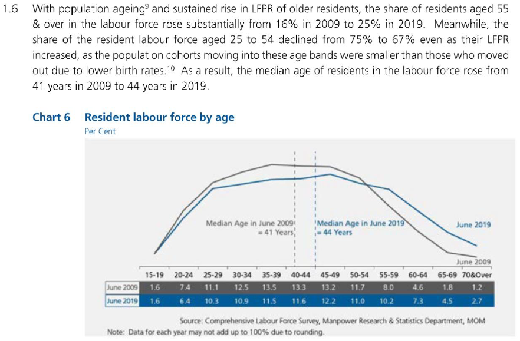
```


|#| <font size="4">Critique                        | <font size="4">Suggestion             |
|-|---------------------------------|------------------------|
|_**Clarity**_|
|1|The text is comparing the sum of share of resident labour force of multiple age groups between 2009 and 2019 but those numbers are not highlighted and requires the reader to do the calculations using the data from the table|Use a separate chart for the comparison between 2 years|
|2|The median age lines are using the table's header as a continuous axis while the line chart is using it as a categorical axis, hence the intersections of the lines are incorrectly representing the labour force participation rate of age 41 and 44, respectively. The The text is also not clear if it's referring to the median age of the labour force or the median age of the population|The median lines should be removed. Some simple annotation would suffice to state the median age in 2009 and 2019|
|3|Title does not represent the message the data visualization tries to convey|Rewrite the title to better describe the data visualization|
|4|The line graph does not have a Y-axis|Add a Y-axis and clearly label the ticks with percentage|
|_**Aesthetic**_|
|1|The background color being grey serves no purpose and makes the 2 colors in the visualization less contrasting. These choice of colors would also be indistinguishable if the report is not color printed|Use a white background with a colored border around the visualization if needed|
|2|Table headers are used as the x-axis of the table which makes the line graph on top looks out of place|Use a separate chart instead|
|3|"70&Over" is too long for the table cell, making it look crammed|"70+" would be more space efficient while still able to convey the meaning|

## Proposed Design

```{r layout="1-body"}
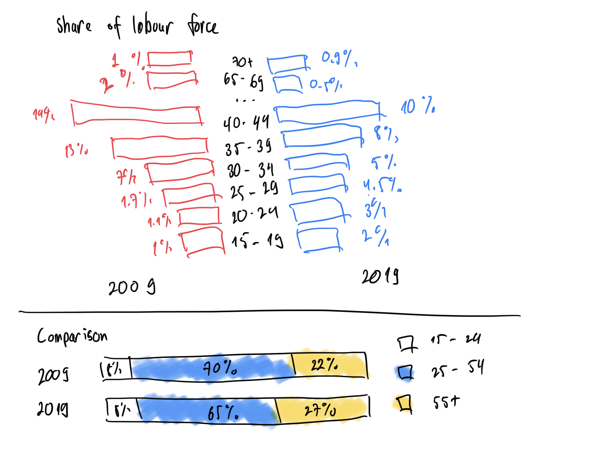
```

## How-to Guide
### Butterfly Chart
1. Copy the data into a new Excel worksheet as the original file has a lot of formatting.
2. Open *Tableau* and connect to the data in the new Excel worksheet.
3. *Hold Ctrl* and click on the columns **2009** and **2019**.
4. *Right-click* on one of the selected columns and select **Pivot**.

```{r layout="2-body"}
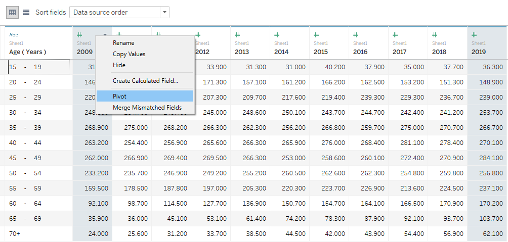
```

5. Rename the pivoted columns to **Year** and **Labour Force** and change the data type of column **Year** column to *Date*.

```{r,  out.width = "30%"}
knitr::include_graphics("images/02rename.png")
```

6. Go to **Sheet1** and rename the sheet to **2009**.
7. Drag-and-drop **Year** and **Labour Force** to the *Columns* card and **Age** to the *Rows* card.

```{r,  out.width = "50%"}
knitr::include_graphics("images/03dragdrop.png")
```

8. *Right-click* on the **Year** pill to select **Filter**.

```{r,  out.width = "50%"}
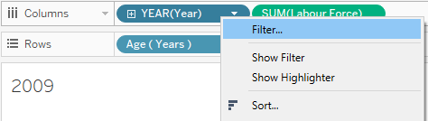
```

9. Un-check **2019** from the list and select *OK*.
10. *Right-click* on the **Labour Force** pill and select **Quick Table Calculation > Percentage of Total**.

```{r layout="2-body"}
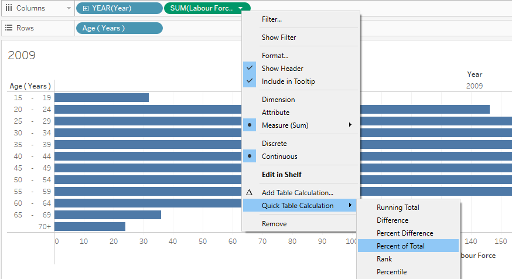
```

11. *Hold Ctrl*, drag-and-drop the **Labour Force** pill from the *Columns* card to *Color* in the *Marks* card.
12. In the **Marks** card, click on **Label** and select *Show marks labels*.

```{r,  out.width = "50%"}
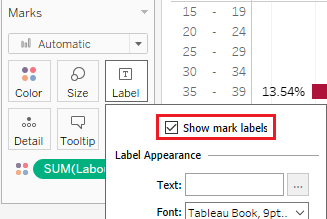
```

13. *Right-click* on the X-axis and select **Edit Axis**:
  + In the *Range* section, select **Fixed** and set the start and end values to **0** and **0.175**, respectively.
  + In the *Scale* section, select **Reversed**.
  + Set the title of the axis to **2009**.

```{r,  out.width = "50%"}
knitr::include_graphics("images/08xaxis.png")
```

14. *Right-click* on the **Age (Years)** pill and un-check **Show Header**.
15. *Right-click* on the **Year** pill and un-check **Show Header**.

```{r,  out.width = "50%"}
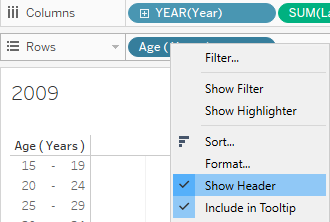
```

16. From the *Toolbar*, select **Format > Lines**:

```{r,  out.width = "50%"}
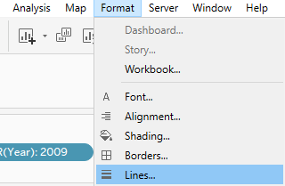
```

  + In the **Columns** tab, set **Grid Lines** to *None*.
  
```{r,  out.width = "30%"}
knitr::include_graphics("images/11gridlinesnone.png")
```

  + Switch to the **Format Borders** tool, under the **Sheet** tab.
  + Set **Row Divider Pane** to *None* and **Column Divider Pane** to *None*.

```{r,  out.width = "30%"}
knitr::include_graphics("images/12bordersnone.png")
```

17. The bar chart should looks as below

```{r layout="1-body"}
knitr::include_graphics("images/13bluehalf.png")
```

18. **Duplicate** the **2009** sheet and rename it **2019**.
19. *Right-click* on the **Year** pill and select **Edit Filter** then un-check 2009 and check 2019.
20. *Right-click* on the X-axis and select **Edit Axis**:
  + Un-check **Reversed**.
  + Rename the axis' title to **2019**.
  
```{r,  out.width = "50%"}
knitr::include_graphics("images/14xaxis.png")
```

22. Create a new sheet and name it **Year**.
23. From the *Toolbar*, select **Analysis > Create Calculated Field**:

```{r,  out.width = "50%"}
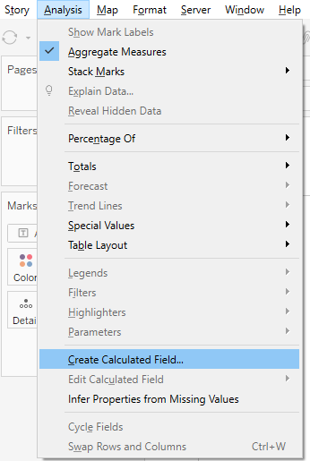
```

  + Name the calculated field **Placeholder for Age**.
  + Enter *0* as the formula.
  
```{r,  out.width = "30%"}
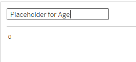
```

24. Drag-and-drop the **Placeholder for Age** field to the *Columns* card.
25. Drag-and-drop the **Age (Years)** field to the *Rows* card.

```{r,  out.width = "50%"}
knitr::include_graphics("images/18placeholder.png")
```

26. Change the **Marks** type to *Text*.
27. Drag-and-drop the **Age (Years)** field to *Text* in the *Marks* card.

```{r,  out.width = "50%"}
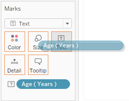
```

28. Right-click on both the **X-axis** and **Y-axis** and un-check **Show Header** to hide the axis.
29. Remove the sheet title.
30. From the *Toolbar*, select **Format > Lines**:
  + On the *Sheet* tab, set **Axis Rulers** to *None*.
  + On the *Sheet* tab, set **Zero Lines** to *None*.
  + On the *Columns* tab, set **Grid Lines** to *None*.
  
```{r,  out.width = "30%"}
knitr::include_graphics("images/20formatlines.png")
```

31. Reduce the width of the "chart" as much as possible.

```{r,  out.width = "50%"}
knitr::include_graphics("images/21width.png")
```

32. Create a new **Dashboard**.
33. Arrange the 3 previous created sheets in the Dashboard to achieve the **Butterfly Chart**.

```{r layout="1-body-outset"}
knitr::include_graphics("images/22butterfly.png")
```

### Stacked Bar Chart

1. Create a new *Sheet* called **Comparison**.
2. In the Data pane, *right-click* on **Age (Years)** and select **Create > Group**:

```{r,  out.width = "50%"}
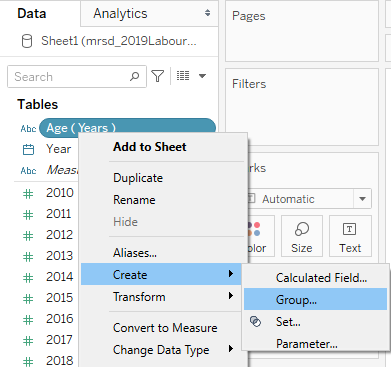
```

  + Set the Field Name to Age Group.
  + Use Shift to select and group all the age groups from 15 to 24 into a group named **15 - 24**.
  + Group all the age groups from 25 to 54 into a group named **25 - 54**.
  + Group all rest of the age groups into a group named **55 and over**.
  
```{r,  out.width = "50%"}
knitr::include_graphics("images/24agegroup.png")
```

3. Drag-and-drop **Year** into the *Rows* card and **Labour Force** into the *Columns* card.
4. *Right-click* on the **Labour Force** pill and select **Quick Table Calculation > Percentage of Total**.

```{r,  out.width = "60%"}
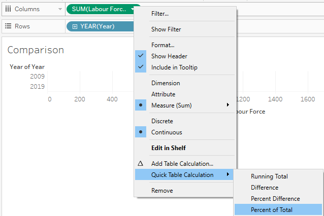
```

5. *Right-click* on the **Labour Force** pill and select **Compute Using > Table (across)**.
6. Change the **Marks** type to *Bar*.
7. Drag-and-drop the **Age Group** group into *Color* in the *Marks* card.
8. Drag-and-drop the **Age Group** group into *Detail* in the *Marks* card.

```{r,  out.width = "30%"}
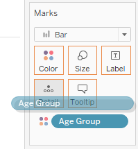
```

9. Right-click on the **Age Group** pill in the *Marks* card and select **Sort**. Choose **Descending**.
10. Set the desired colors for the **Age Group**.

```{r,  out.width = "30%"}
knitr::include_graphics("images/27colors.png")
```

11. Remove the title and field labels of Year.
12. Arrange the new bar chart into the final dashboard.
13. Finally, add observations and annotation. Voila!

## Final Dashboard

[Link to Tableau Public](https://public.tableau.com/profile/bui.anh.hoang3167#!/vizhome/DataViz1v2/DataViz?publish=yes)

```{r layout="l-body-outset"}
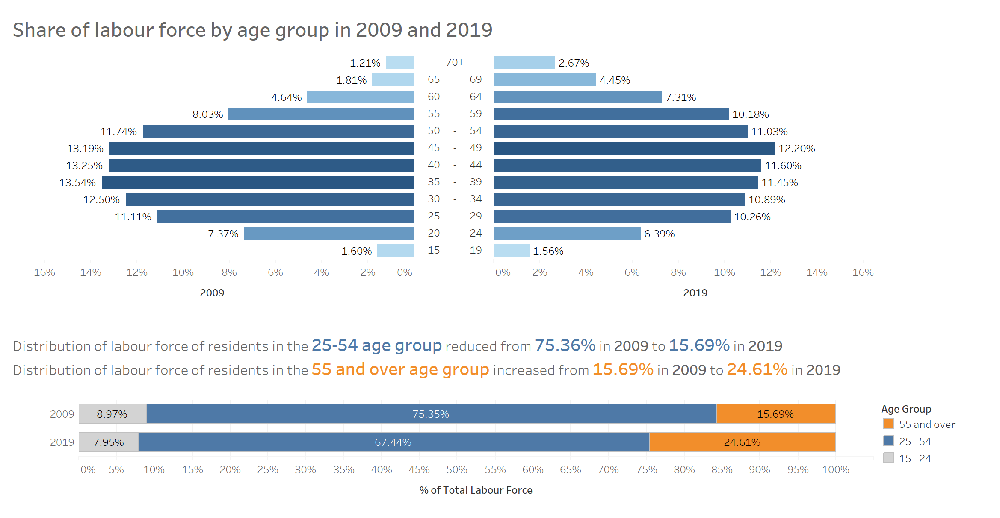
```

### Insights
+ Singapore seems to have an aging workforce as the distribution of the labour force is leaning more towards the older age group in 2019 compare to 2009.
+ The distribution of all the age groups from 60 and above have the largest increase in 2019 relative to 2009, indicating that elder people may still have to work instead of retiring.
+ The age group which held the largest distribution in 2009 is 35-39, however, by 2019, the age group with the biggest distribution has shifted to age group 45-49.