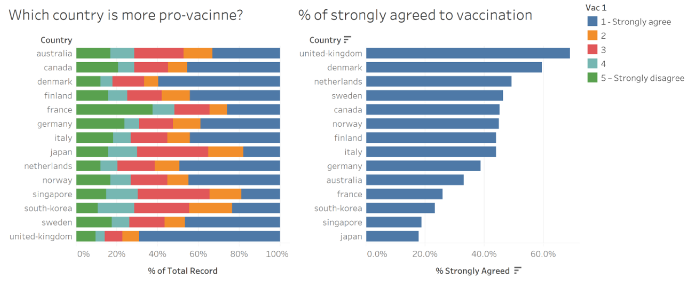
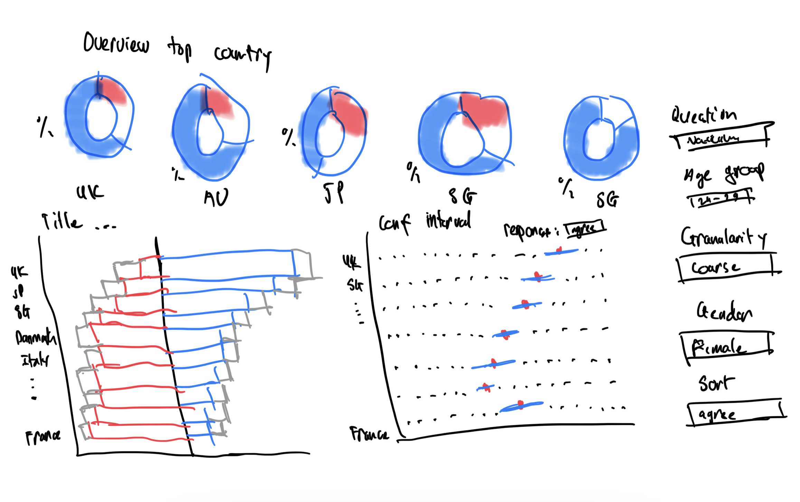

```{r setup, include=FALSE}
knitr::opts_chunk$set(echo = FALSE)
```

## Critiques and Suggestions

Original Visualization

```{r layout="2-body"}

```


|#| <font size="4">Critique                        | <font size="4">Suggestion             |
|-|---------------------------------|------------------------|
||_**Clarity**_|
|1|The leading texts in the data visualization do not provide any adequate context for the reader to understand what the data visualization is about and the insights it is trying to convey|Clearly state the purpose of the data visualization with some short description|
|2|The legend is unclear in that the values "2", "3" and "4" by itself does not provide any explanation as to which color in the chart represent which answer. Not only that, "Vac_1" is also meaningless to users since it is only a code to refer to the actual question|The survey question should be clearly displayed in the data visualization, not necessarily above the legend|
|3|A 100% stacked bar chart is not a suitable visualization for this data since it can be difficult to compare the bars between countries|Use a divergent stacked bar chart|
|4|The bar chart on the right is trying to show the percentage of the "Strongly Agree" response to the survey question, which contains uncertainties since a survey does not represent the whole population, hence the chart needs to also visualize the uncertainty |Display the 95% and 99% confidence level on the chart in order to visualize the uncertainty|
|5|The left chart is sorting alphabetically while the right chart is sorting descendingly based on the proportion of "Strongly Agree" response. This can easily cause confusion without carefully inspecting the 2 Y-axis|Use the same sort order for both charts|
||_**Aesthetic**_|
|1|There are no coordination between the colors in the bar chart, giving the data visualization a messy look|Use one shade of color to represent the positive or negative sentiment and use gradient colors to show the different strengths of each sentiment|
|2|Typo in the word "vaccine"|Use the correct word|
|3|Country names should be capitalized and should not contain special characters|Properly display the country names|

## Proposed Design

```{r layout="1-body"}

```

+ Since the survey contains multiple questions, an **Overview** section on top of the data visualization can provide some quick insights about the result of the survey. 
+ The responses for the survey are following a Likert scale, hence using a **divergent stacked bar** chart is suitable as it allows easy comparison of response proportion across rows. To take it a step further, with the **NeutraL** response not being very useful in showing the general sentiment regarding the survey question, the **Neutral** bar will be split in half and each half will be placed on the outside to allow the stronger sentiments to be in the middle. This makes it easier to compare the strong sentiments between countries. Whether to show the **Neutral** bar in the chart should also be toggle-able by the user.
+ The dot chart on the right side will be used to visualize the proportion of a response to a survey question. The filter on top will allow the read to switch between different responses, including combined response such as "Strongly Agree & Agree". Additionally, the chart will also display the **95% and 99% confidence interval** to visualize the uncertainties for each country and the user be able to toggle the confidence intervals on and off.
+ Some readers may prefer to combine similar responses with each other to convert the data into only three levels of sentiments. However, being able to see the proportion of the responses in details can be beneficial in some use cases e.g. comparing the responses between two countries with similar overall positive sentiments. As such, the data visualization should allow users to toggle the **Granularity** of the chart in order to choose between a simplified view or a detailed view.
+ Some additional filters such as **Age** and **Gender** will be placed on the side the data visualization to allow users to filter out the respondents to a specific demographic.

## How-to Guide
### Data Cleaning

The dataset consists of 30 CSV files, one for each country. However, only 15 countries have the response for the questions that we want to visualize. For convenience, the dataset was combined and extracted using Jupyter Notebook with the following Python code:
```
import pandas as pd
import glob
import os

path = r'<Path to folder containing csv files>' # use your path
all_files = glob.glob(os.path.join(path, "*.csv"))

df = pd.concat((pd.read_csv(f).assign(
        filename = os.path.basename(f)) for f in all_files), ignore_index=True)
columns = ['filename', 'age', 'gender', 'weight', 'employment_status', 'household_size',
          'household_children', 'endtime', 'state', 'vac_1', 'vac2_1','vac2_2',
          'vac2_3', 'vac2_6', 'vac_3']

df[df['vac_1'].notnull()][columns].to_csv('preped_data.csv')
```

The final data file can be [Download Here](https://smu-my.sharepoint.com/:x:/g/personal/ahbui_2019_mitb_smu_edu_sg/ER_fKuT_8lhDlgtD0OxV14gBd2aA58PrjiZxXMr_Eg0Sog?e=Wexnds)

1. Open Tableau and connect to the data file from the previous section.
2. Right-click on the Filename column and select Split
3. Hide the Filename column and rename the new Filename - Split 1 column to Country
4. Right-click on the Country column and select Alias then set the country names to the proper format with capitalization.
5. Rename the following columns to their respective question:
  + vac_1 - I am worried about getting COVID19
  + vac2_1 - I am worried about potential side effects of a COVID19 vaccine
  + vac2_2 - I believe government health authorities in my country will provide me with an effective COVID19 vaccine
  + vac2_3 - If a Covid-19 vaccine becomes available to me a year from now, I definitely intend to get it
  + vac2_6 - If a Covid-19 vaccine were made available to me this week, I would definitely get it
  + vac_3 - If I do not get a COVID19 vaccine when it is available, I will regret it
6. Select all the question columns in step 5 and Pivot them
7. Rename the pivoted columns to Question and Answer
8. Result:

```{r layout="1-body"}
knitr::include_graphics("images/01columns.png")
```

### Divergent Stacked Bar

1. Go to Sheet1 and rename the sheet to Likert.
2. Create the following Parameters:
+ Granularity:

```{r,  out.width = "60%"}
knitr::include_graphics("images/02granularity.png")
```

+ Neutral Response:

```{r,  out.width = "60%"}
knitr::include_graphics("images/03neutral.png")
```

+ Sort By:

```{r,  out.width = "60%"}
knitr::include_graphics("images/04sortby.png")
```

3. Create the following Calculated Fields:
+ Response:
```
IF [Granularity] = "Coarse" THEN 
    IF [Answer] = "1 - Strongly agree" OR [Answer] = "2"
    THEN "Agree "
    ELSEIF [Answer] = "3"
    THEN "Neutral"
    ELSE "Disagree "
    END
ELSE
    IF [Answer] = "1 - Strongly agree"
    THEN "Strongly Agree"
    ELSEIF [Answer] = "2"
    THEN "Agree"
    ELSEIF [Answer] = "3"
    THEN "Neutral"
    ELSEIF [Answer] = "4"
    THEN "Disagree"
    ELSE "Strongly Disagree"
    END
END
```
+ Count Agree: 
```
IF [Response] = "Agree" OR [Response] = "Strongly Agree" OR [Response] = "Agree "
THEN 1
ELSE 0
END
```
+ Count Disagree:
```
IF [Response] = "Disagree" OR [Response] = "Strongly Disagree" OR [Response] = "Disagree "
THEN 1
ELSE 0
END
```
+ Count Negative:
```
IF [Response] = "Disagree" OR [Response] = "Strongly Disagree" OR [Response] = "Disagree "
THEN -1
ELSEIF [Response] = "Neutral" AND [Neutral Response] = TRUE
THEN -0.5
ELSE 0
END
```
+ Count Positive:
```
IF [Response] = "Agree" OR [Response] = "Strongly Agree" OR [Response] = "Agree "
THEN 1
ELSEIF [Response] = "Neutral" AND [Neutral Response] = TRUE
THEN 0.5
ELSE 0
END
```
+ Label Negative:
```
IF  AVG([Neutral Check])*[Percentage Negative] = 0 THEN NULL
ELSE [Percentage Negative]
END
```
+ Label Positive:
```
IF  AVG([Neutral Check])*[Percentage Positive] = 0 THEN NULL
ELSE [Percentage Positive]
END
```
+ Neutral Check:
```
IF [Response] = "Neutral" THEN 0
ELSE 1
END
```
+ Number of Records:
```
1
```
+ Percentage Agree:
```
SUM([Count Agree])/SUM({Exclude [Response]:SUM([Number of Records])})
```
+ Percentage Disagree:
```
-SUM([Count Disagree])/SUM({Exclude [Response]:SUM([Number of Records])})
```
+ Percentage Negative:
```
SUM([Count Negative])/SUM({Exclude [Response]:SUM([Number of Records])})
```
+ Percentage Positive:
```
SUM([Count Positive])/SUM({Exclude [Response]:SUM([Number of Records])})
```
+ Sort By Field:
```
CASE [Sort By]
    WHEN 'Agree' THEN SUM([Count Agree])/SUM({Exclude [Response]:SUM([Number of Records])})
    WHEN 'Disagree' THEN SUM([Count Disagree])/SUM({Exclude [Response]:SUM([Number of Records])})
    WHEN 'Agree (Including Neutral)' THEN SUM([Count Positive])/SUM({Exclude [Response]:SUM([Number of Records])})
    WHEN 'Disagree (Including Neutral)' THEN -SUM([Count Negative])/SUM({Exclude [Response]:SUM([Number of Records])})
END
```
+ Total Count:
```
TOTAL(SUM([Number of Records]))
```

4. Put **Answer** in the Filter card and uncheck the Null value.
5. Put Country in the Rows card the Percentage Negative and Percentage Positive in the Columns card
6. Right-click on the Percentage Positive pill and select Dual Axis

```{r,  out.width = "70%"}
knitr::include_graphics("images/05cards.png")
```

7. Right-click on either of the X-axis and select Synchronize Axis.
8. In the Marks card, change the type of All to Bar.
9. Drag-and-drop Response into the Color tool in the Marks card

```{r,  out.width = "25%"}
knitr::include_graphics("images/06marks.png")
```

10. In the filter shelf, drag-and-drop to reorder Neutral to the top of the list and set the colors and order of Response as follow

```{r,  out.width = "25%"}
knitr::include_graphics("images/07response.png")
```

11. Right-click on the Granularity, Neutral Response and Sort By parameter and select Show Parameter for each of them
12. Set Granularity to Detailed
13. Order and set the color of Response again

```{r,  out.width = "25%"}
knitr::include_graphics("images/08response.png")
```

14. Right-click on the Percentage Negative Axis and select Edit Axis
15. Change the Range to Fixed and set Fixed start to -0.7 and Fixed end to 1
16. Remove the Title of the axis

```{r,  out.width = "50%"}
knitr::include_graphics("images/09axis.png")
```

17. Hide the top axis (Percentage Positive)
18. Right-click on the bottom axis and select Format
19. Under the Scale section, change numbers to Percentage with 0 decimal places, then click on Custom and set the value as follow

```{r,  out.width = "70%"}
knitr::include_graphics("images/10percent.png")
```

20. Drag-and-drop Label Negative to Label in the Marks > AGG(Percentage Negative) card

```{r,  out.width = "30%"}
knitr::include_graphics("images/11marks.png")
```

21. Right-click on the Label Negative pill and select format.
22. Set the format to Percentage similar to step 19, but this time set decimal places to 1 and the customer format to **0.0%;0.0%**
23. Drag-and-drop Label Positive to Label in the Marks > AGG(Percentage Positive) card
24. Set the format of Label Positive similar to the format of Label Negative in step 22
25. Right-click on the Country pill in the Rows card and select Sort
26. Set Sort By to Field, Sort Order to Descending and Field Name to Sort By Field

```{r,  out.width = "35%"}
knitr::include_graphics("images/12sort.png")
```

#### Legends

27. Create the following Calculated Fields:
+ Legend Coarse Agree:
```
IF [Granularity] = "Coarse" THEN "Agree"
ELSE "Strongly Agree"
END
```
+ Legend Coarse Disagree:
```
IF [Granularity] = "Coarse" THEN "Disagree"
ELSE "Strongly Disagree"
END
```
+ Legend Detailed Agree:
```
IIF([Granularity]="Detailed","Agree","")
```
+ Legend Detailed Disagree:
```
IIF([Granularity]="Detailed","Disagree","")
```
+ Legend Neutral:
```
IF [Neutral Response] THEN "Neutral"
ELSE ""
END
```
+ Legend Pipe Symbol:
```
IIF([Granularity]="Detailed","|","")
```

28. Drag-and-drop all 6 Legend fields into the Detail of the Marks > All card

```{r,  out.width = "30%"}
knitr::include_graphics("images/13marks.png")
```

29. Set the title of the sheet as follow and change the title shading to yellow:

```{r,  out.width = "65%"}
knitr::include_graphics("images/14title.png")
```

30. On the Toolbar, select Format > Lines
31. Set Column Grid Lines to None and Row Grid Lines to a grey line

```{r,  out.width = "50%"}
knitr::include_graphics("images/15lines.png")
```

32. The divergent stacked bar chart is now complete. We will revisit it later to configure the Tooltip

```{r,  out.width = "100%"}
knitr::include_graphics("images/16chart.png")
```

### Confidence Interval

1. Create a new worksheet and name it Confidence Interval
2. Create and show following Parameters:
+ Response Selector:

```{r,  out.width = "60%"}
knitr::include_graphics("images/17para.png")
```

+ Show:

```{r,  out.width = "60%"}
knitr::include_graphics("images/18show.png")
```

3. Create the following Calculated Fields:
+ Count Response:
```
IF [Response Selector] = "6" THEN
    IF [Answer] = "1 - Strongly agree" OR [Answer] = "2"
    THEN 1
    ELSE 0
    END
ELSEIF  [Response Selector] = "7" THEN
    IF [Answer] != "1 - Strongly agree" AND [Answer] != "2" AND [Answer] != "3"
    THEN 1
    ELSE 0
    END
ELSEIF [Answer] = [Response Selector] Then 1
ELSE 0
END
```
+ Response CI Lower 95%:
```
IF [Show]="2" or [Show]="4" THEN [Selected Response]-[Response SE]*[Z_95%] END
```
+ Response CI Lower 99%:
```
IF [Show]="3" or [Show]="4" THEN [Selected Response]-[Response SE]*[Z_99%] END
```
+ Response CI Upper 95%:
```
IF [Show]="2" or [Show]="4" THEN [Selected Response]+[Response SE]*[Z_95%] END
```
+ Response CI Upper 99%:
```
IF [Show]="3" or [Show]="4" THEN [Selected Response]+[Response SE]*[Z_99%] END
```
+ Response SE:
```
SQRT(([Selected Response]*(1-[Selected Response]))/SUM([Number of Records]))
```
+ Selected Response:
```
SUM([Count Response])/SUM([Number of Records])
```
+ Z_95%:
```
1.959964
```
+ Z_99%:
```
2.575829
```

3. Put Answer in the Filter card and remove the Null value
4. Place Country in the Rows card and Selected Response in the Columns card
5. Place Response CI Lower 99% to the Columns card and set it to Dual Axis
6. Drag Response CI Upper 99% to the Response CI Lower 99% until a green equal icon appears, then drop

```{r,  out.width = "20%"}
knitr::include_graphics("images/19icon.png")
```

6. Drag-and-drop Response Lower 95% to the Measure Values card
7. Drag-and-drop Response Upper 95% to the Measure Values card. Final result should be in this specific order:

```{r,  out.width = "30%"}
knitr::include_graphics("images/20measures.png")
```

8. Right-click on Selected Response and select Synchronize Axis
9. Set the Show parameter to Actual and 95%/99% if it has not been set
10. In the Marks > Measure Values card, change the type to Line
11. Hold Ctrl, drag-and-drop the Measure Names pills to the Path box

```{r,  out.width = "25%"}
knitr::include_graphics("images/21lines.png")
```

12. Set the color of Measure Names as follow

```{r,  out.width = "25%"}
knitr::include_graphics("images/22colors.png")
```

13. Swap the order of Measure Values and Selected Response in the Column Card
14. Hide the top X-axis
15. Right-click on the bottom axis and select Edit Axis
16. Remove the Title and uncheck Include zero

```{r,  out.width = "50%"}
knitr::include_graphics("images/23axis.png")
```

17. Change the format of the X-axis to Percentage with 0 decimal place
18. Set the title and change it's shading to yellow

```{r,  out.width = "65%"}
knitr::include_graphics("images/24title.png")
```

19. The visualization for uncertainties is now completed

```{r,  out.width = "100%"}
knitr::include_graphics("images/25chart.png")
```

### Pie/donut charts


### Tooltip


### Insights


