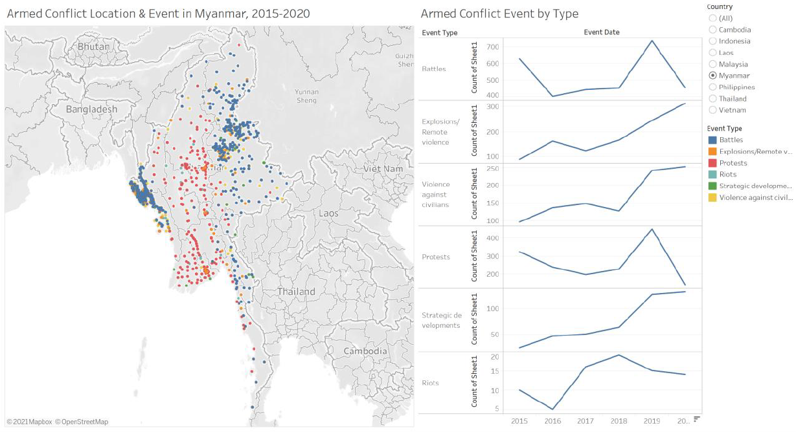
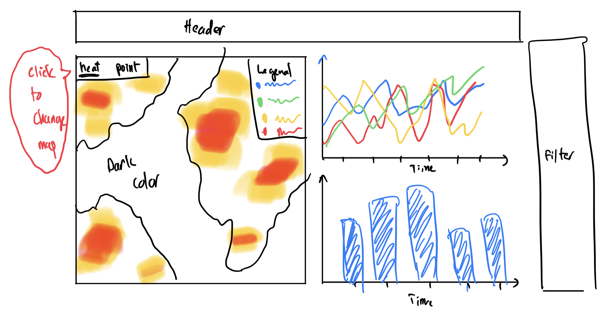
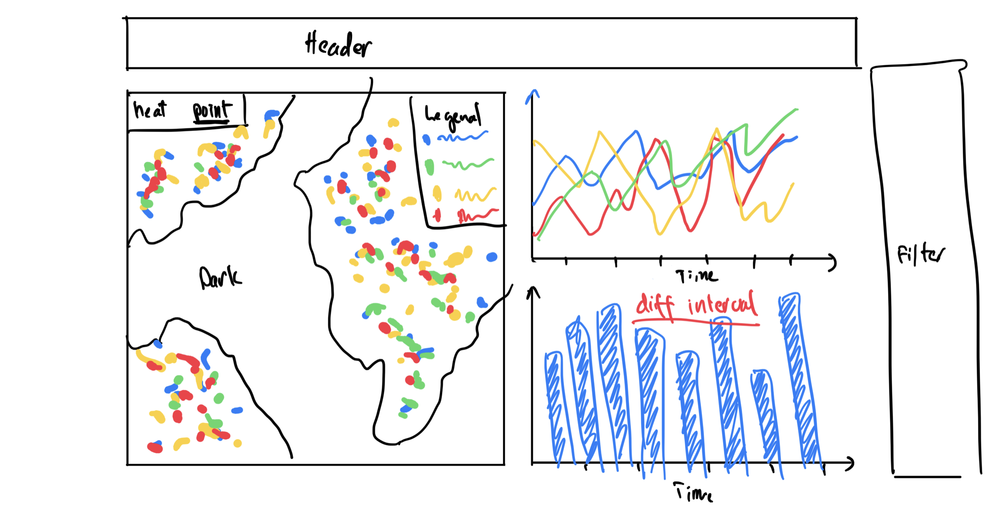
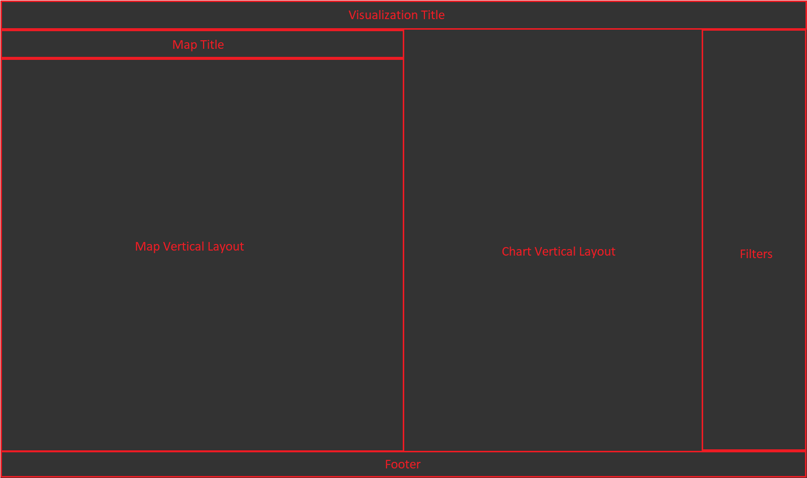
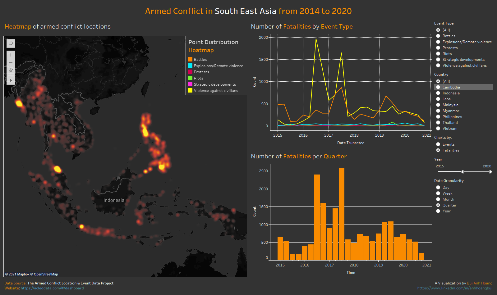
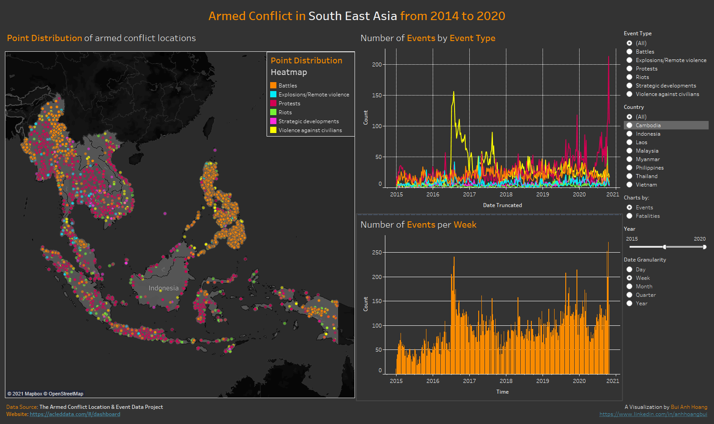
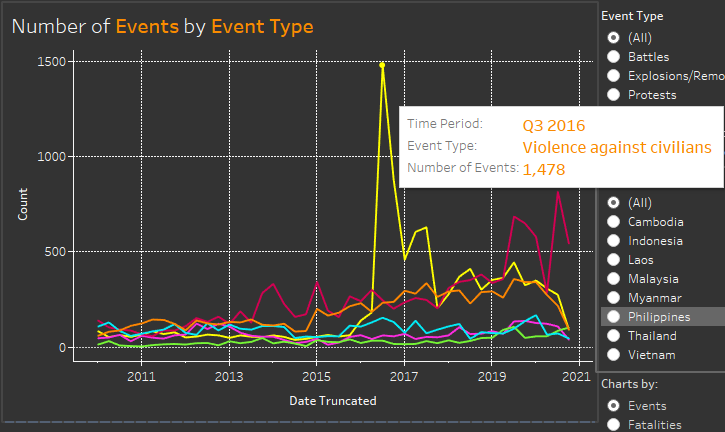
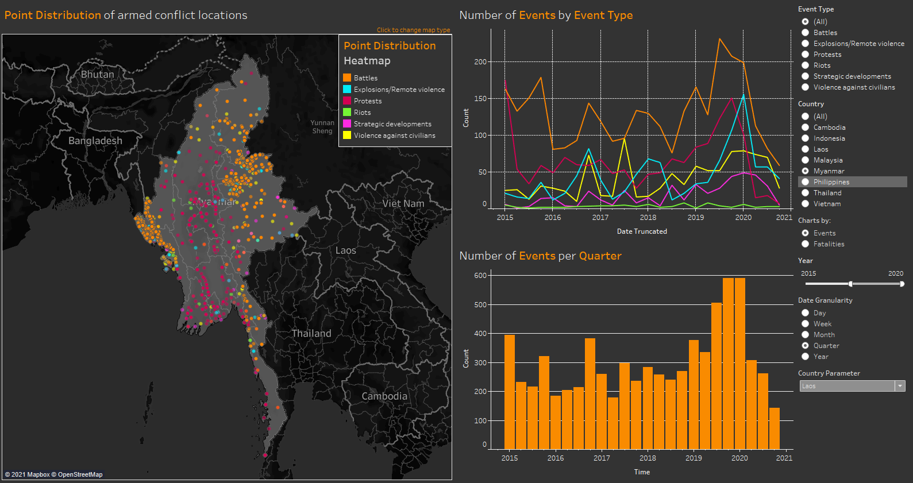
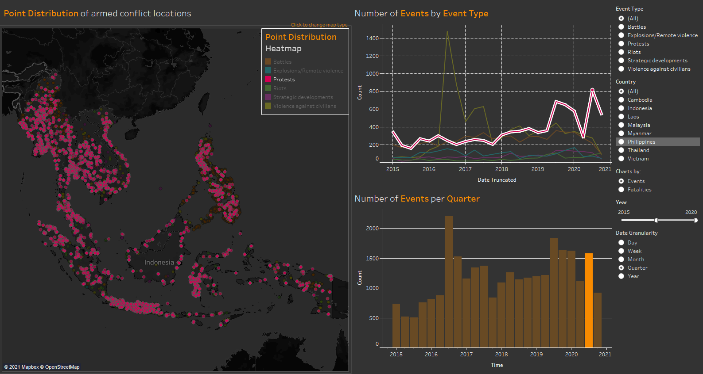
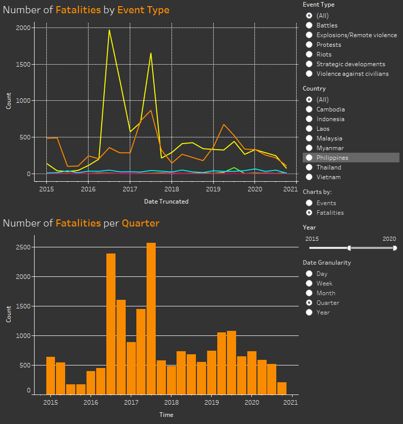

<style>
body {
text-align: justify}
</style>

```{r setup, include=FALSE}
knitr::opts_chunk$set(echo = FALSE)
```

## Critiques and Suggestions

Original Visualization

```{r layout="2-body"}

```


|#| <font size="4">Critique                        | <font size="4">Suggestion             |
|-|---------------------------------|------------------------|
||_**Clarity**_|
|1|The scale of the Y-axis of the line charts are not synchronized, which can lead to misinterpretation when comparing the number of events. For example, on first glance, it would seem like in 2020, there are more Explosions events compare to Battles  but it is in fact the other way around|Synchronized all the Y-axis to have the same scale, or better yet, combine all 6 line charts into a single chart|
|2|Title of the chart on the right does not reflect the content of the chart, which is a count of events per event type|Rephrase the title of the line charts to provide better details|
|3|"Count of Sheet1" is meaningless in explaining the Y-axis and redundant|Remove "Count of Sheet1" from the visualization|
||_**Aesthetic**_|
|1|The dots in the map do not have any borders and are not transparent, which makes it difficult to discern events which are overlapped or near to each other|Add borders for each point and make them slightly transparent|
|2|The line charts are not color coded and ordered in a different order compare to the provided legend, which can cause confusion|Color code the lines such that they follow the color of the Event Types in the map|
||_**Interactivity**_|
|1|The visualization does not provided a filter for Event Date and Event Type|Add a filter for Event Date and Event Type|
|2|There are no interactions between the map and the charts on the right|Add interactions such as selecting a point in the map will highlight the line chart pertaining to the event type of the selected point|

## Proposed Design

```{r,  out.width = "100%"}

```

```{r,  out.width = "100%"}

```

+ Because the locations in the dataset are not standardized, the events can only be grouped to the Country level, hence choropleth map is not suitable to represent the data. A better way to visualize the spatial data is by using both a **heatmap**, for overview of the location and density of the armed conflict events, and a **point distribution** map for more detailed view of individual events. Users will have the option to switch between the 2 types of map.
+ Instead of having separate line charts similar to the original visualization, combining the line charts into a single chart will make it easier to do comparison across event types. The lines will be color coded in the same color as the map's legend.
+ Putting the legend at the top right corner of the map will allow the legends be referenced when using both the map and the line charts.
+ The dataset contains event dates to the date level, hence some insights maybe lost when the events are grouped by year. Having a **Date Granularity** parameter will give users the option to group or drilldown by events dates, potentially providing additional insights.
+ The maps and the line charts are highly correlated so a helpful interaction would be to highlight the same event type on both the map and the line chart when user clicks on either a certain events in the map or a line in the chart.

## How-to Guide

### Point Distribution Map

1. Open Tableau and add the data file as a data source
2. Go to **Sheet1** and rename the sheet to **Point**
3. Add **Longitude (generated)** into the Columns card.
4. Add **Latitude (generated)** into the Rows card two times and make them Dual Axis.

```{r,  out.width = "50%"}
knitr::include_graphics("images/01rowcolumn.png")
```

5. For the first **Marks** card, set the mark type to **Map** and *drag-and-drop* **Country** into **Detail**. Set **Color** to **#b4b4b4** with **40%** *opacity*.

```{r,  out.width = "20%"}
knitr::include_graphics("images/02map.png")
```

6. For the second **Marks** card, set the mark type to **Circle** and *drag-and-drop*:
    + **Event Type** to **Color**.
    + **Latitude** to **Detail** and set **Measure** to **Average**.
    + **Longitude** to **Detail** and set **Measure** to **Average**.
    + **Event Id Cnty** to **Detail**.

```{r,  out.width = "20%"}
knitr::include_graphics("images/03circle.png")
```

7. Set the colors for **Event Type** as follow, using the color picker tool provided by *Tableau*.

```{r,  out.width = "35%"}
knitr::include_graphics("images/04colors.png")
```

8. Set the *border color* for the **Circle** mark to **#555555** and *opacity* to **60%**.

9. Add **Country**, **Event Type** and **Event Date** (by *Year*) to the **Filters** card. *Right-click* on each one of them and select **Apply to Worksheets** > **All Using This Data Source**.

10. On the *Toolbar*, change the map background color by selecting **Map** > **Background Maps** > **Dark**. By now, the visualization should look like this:

```{r,  out.width = "100%"}
knitr::include_graphics("images/05point.png")
```

11. Create a **Parameter** named **Map Selection** with the following properties:

```{r,  out.width = "50%"}
knitr::include_graphics("images/08parameter.png")
```

12. Show the **Map Selection** parameter and set the value to **Point Distribution**.

13. Create a **Calculated Attribute** named **Selected Map** with the formula below:

```
[Map Selection]
```

14. Add the **Selected Map** attribute into the **Filters** card and select the **Point Distribution** checkbox in the filter dialogue.

```{r,  out.width = "50%"}
knitr::include_graphics("images/09filter.png")
```

### Heatmap

1. Create a new sheet and name it **Heatmap**.
2. Add **Longitude** too the **Columns** card and **Latitude** to the **Rows** card. *Right-click* on each of the pills and select *Dimension*.
3. Set the **Marks** type to **Density**.
4. *Drag-and-drop* **Country** to **Detail** in the card.
5. *Drag-and-drop* **Event Type** to **Detail** in the card.

```{r,  out.width = "20%"}
knitr::include_graphics("images/06heat.png")
```

6. Set the mark **Color** to **Density Dark Red** and **Intensity** to **90%**.
7. Lower the **Size** of the marks to about 1/4 of the bar.
8. On the *Toolbar*, change the map background color by selecting **Map** > **Background Maps** > **Dark**.

```{r,  out.width = "100%"}
knitr::include_graphics("images/07heatmap.png")
```

12. Show the **Map Selection** parameter and set the value to **Heatmap**.
13. Add the **Selected Map** attribute into the **Filters** card and select the **Heatmap** checkbox in the filter dialogue.

```{r,  out.width = "50%"}
knitr::include_graphics("images/10filter.png")
```

### Line Chart

1. Create a new sheet called **Line**.
2. Create a new **Parameter** called **Date Granularity** with the following properties. *Note: the values on the left column need to be in lower case*.

```{r,  out.width = "50%"}
knitr::include_graphics("images/11para.png")
```

3. Create a new **Calculated Attribute** called **Date Truncated** with the formula below:

```
DATE(DATETRUNC([Date Granularity], [Event Date]))
```

4. Create a new **Parameter** called **Charts By** with the following properties:

```{r,  out.width = "50%"}
knitr::include_graphics("images/12para.png")
```

5. Create a new **Calculated Attribute** called **Chart Count** with the formula below:

```
IF [Charts By] = 'Events' 
THEN 1 
ELSE [Fatalities]
END
```

6. Add **Date Truncated** to the **Columns** card. *Right-click* on the pill and select **Exact Date**.
7. Add **Chart Count** to the **Rows** card.

```{r,  out.width = "40%"}
knitr::include_graphics("images/13rowcolumn.png")
```

8. Set the **Marks** type to **Line**.
9. *Drag-and-drop* **Event Type** to **Color** in the Marks card.
10. On the **Toolbar**, select **Format** > **Shading**.
11 Set the Worksheet shading color to **#333333**.

```{r,  out.width = "30%"}
knitr::include_graphics("images/14shading.png")
```

12. In the same format pane, switch to the **Lines** tab and set the *Sheet* **Grid Lines** to *dotted line* with the color **#f5f5f5**.

13. Set the titles of both axis to the color **#f5f5f5**.
14. Set the title of the worksheet to:

```{r,  out.width = "60%"}
knitr::include_graphics("images/15title.png")
```

15. Create a **Calculated Field** named **Date Display** with the formular below:

```
CASE [Date Granularity]
    WHEN 'day' THEN STR([Date Truncated])
    WHEN 'week' THEN 'Week ' + DATENAME([Date Granularity],[Event Date]) + ' of ' + DATENAME('year', [Event Date])
    WHEN 'month' THEN DATENAME([Date Granularity],[Event Date]) + ' ' + DATENAME('year', [Event Date])
    WHEN 'quarter' THEN 'Q' + DATENAME([Date Granularity],[Event Date]) + ' ' + DATENAME('year', [Event Date])
    WHEN 'year' THEN DATENAME([Date Granularity],[Event Date])
END
```

16. Click on **Tooltip** in the **Marks** card and set it as follow:

```{r,  out.width = "60%"}
knitr::include_graphics("images/23tooltip.png")
```

### Bar charts

1. Create a new sheet called **Bar**.
2. Create a new **Calculated Attribute** called **Bar Size** with the formula below. This formula is to calculate the width of a bar, with the 0.9 modifier used to create small gap between bars.

```
0.9*DATEDIFF('day', [Date Truncated], DATEADD([Date Granularity], 1, [Date Truncated]))
```

3. Add **Date Truncated** to the **Columns** card. *Right-click* on the pill and select **Exact Date**.
4. Add **Chart Count** to the **Rows** card.
5. Set the **Marks** type to **Bar**.
6. *Drag-and-drop* **Bar Size** to **Size** in the Marks card and change its measure to **Average**.
7. Click on **Size** in the Marks card and select **Fixed**. Set **Alignment** to **Center**.

```{r,  out.width = "30%"}
knitr::include_graphics("images/15title.png")
```

8. Change the bar color to **#f98b00**.
9. On the **Toolbar**, select **Format** > **Shading**.
10 Set the Worksheet shading color to **#333333**.

```{r,  out.width = "30%"}
knitr::include_graphics("images/14shading.png")
```

12. Set the titles of both axis to the color **#f5f5f5**.
13. Set the title of the worksheet to:

```{r,  out.width = "60%"}
knitr::include_graphics("images/17title.png")
```

### Dashboard
Before we can start arranging the the dashboard, we need to create a couple more components.

1. Create a new Excel or csv file with the following data:

```{r,  out.width = "40%"}
knitr::include_graphics("images/18data.png")
```

2. Create a new sheet in Tableau called **Map Selection**.
3. Add the excel (or csv) file into the sheet as a new data source by selecting **Data** > **New Data Source** on the *Toolbar*.
4. Create a new **Parameter** called **Map Selection** with the following properties:

```{r,  out.width = "50%"}
knitr::include_graphics("images/19para.png")
```

5. Create a **Calculated Attribute** called **Selected Map Color** with the formula below:

```
IF [Chart Value]=[Map Selection]
    THEN 1
    ELSE 0
END
```

6. Add **Chart Title** to the **Rows** card.
7. Add **Selected Map Color** to **Color** in the **Marks** card.
8. Add **Chart Title** to **Text** in the **Marks** card.
9. Add **Chart Value** to **Detail** in the **Marks** card.
10. Set the sheet background color/shading to **#333333** and remove all row and column lines.

```{r,  out.width = "50%"}
knitr::include_graphics("images/20select.png")
```

11. Create a new sheet called **Tooltip**.
12. Add **Chart Count** to the **Columns** card and **Event Type** to the **Rows** card.
13. *Right-click* on **Event Type** and select **Sort**. Configure the sort as follow:

```{r,  out.width = "30%"}
knitr::include_graphics("images/21sort.png")
```

14. Add **Event Type** to **Color** in the **Marks** card.
15. Go back to the **Bar** worksheet.
16. Click on **Tooltip** in the **Marks** card and set it as follow:

```{r,  out.width = "60%"}
knitr::include_graphics("images/22tooltip.png")
```

17. Create a new **Dashboard** called **Dashboard**.
18. Set the dashboard **Size** to **1600x950**.
19. Setup the initial layout for the dashboard as follow, using the **Vertical** object for the map, charts, and filter layout.

```{r,  out.width = "100%"}

```

20. Set the **Map Selection** parameter to **Point Distribution** and add the **Point** worksheet into the **Map Vertical Layout** layout and remove the title.
21. Set the **Map Selection** parameter to **Heatmap**, which will make the **Point** sheet hidden on the dashboard, and add the **Heatmap** worksheet into the same **Map Vertical Layout** layout then remove the title.
22. Add the **Line** and **Bar** sheets into the **Charts Vertical Layout** layout, with the **Line** sheet on top.
23. Add all the filters into the **Filters** layout.
24. *Remove* the **Map Selection** parameter from the dashboard since we're going to use a dashboard action to trigger the parameter.
25. Add the dashboard title and the map title worksheets into their respective layout. The dashboard should look like this at this point.

```{r,  out.width = "100%"}
knitr::include_graphics("images/25dash.png")
```

26. Add a new **Vertical** layout object into the **Filter** layout and add the **Map Selection** worksheet and the **Event Type** legend to it, with the **Map Selection** on top.

27. Make the new **Vertical** layout a **Floating** layout and set the background shading to **#333333** and border to **#f5f5f5**.
28. Move the floating vertical layout to the top right of the map.

```{r,  out.width = "40%"}
knitr::include_graphics("images/26legend.png")
```

29. On the **Toolbar**, select **Dashboard** > **Action>>.
30. Add the following dashboard actions:

```{r,  out.width = "60%"}
knitr::include_graphics("images/27dash.png")
```

```{r,  out.width = "60%"}
knitr::include_graphics("images/28dash.png")
```

```{r,  out.width = "60%"}
knitr::include_graphics("images/29dash.png")
```

## Final Dashboard

[Link to Tableau Public](https://public.tableau.com/profile/bui.anh.hoang3167#!/vizhome/DataViz3-ArmedConflictinSouthEastAsia/Dashboard?publish=yes)

```{r layout="l-body-outset"}

```

Alternative view with different map type and date granularity

```{r layout="l-body-outset"}

```

### Insights

+ Most of the armed conflicts in South East Asia are centralized in Myanmar and Philippines.

```{r,  out.width = "100%"}
knitr::include_graphics("images/insight1.png")
```

+ There is a large spike of events and fatalities during Q3 2016, which is due to the violence against civilians events in Philippines

```{r,  out.width = "100%"}

```

+ From 2015 to 2020, the most common armed conflict events in Myanmar are of the "Battles" type, with a larger cluster on the Western coast of the country.

```{r,  out.width = "100%"}

```

+ In recent years, protests are the most common type of armed conflicts in SOuth East Asia, with a relatively even split across many countries.

```{r,  out.width = "100%"}

```

+ "Battles" and "Violence against civilians" type of events are the most deadly, contributing to most of fatalities during the period from 2015 to 2020.

```{r,  out.width = "100%"}

```
